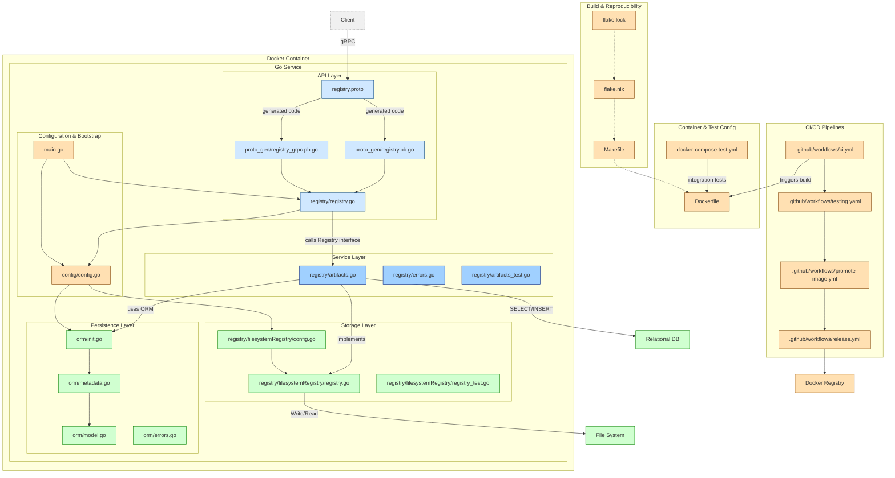

# Enclave Artifact-Registry

```mermaid
flowchart TD
    %% External Client
    Client["Client"]:::external
    %% Go Service Container
    subgraph "Docker Container" 
        direction TB
        subgraph "Go Service"
            direction TB
            %% Configuration & Bootstrap
            subgraph "Configuration & Bootstrap"
                direction TB
                Config["config/config.go"]:::config
                Main["main.go"]:::config
            end
            %% API Layer (gRPC Server)
            subgraph "API Layer"
                direction TB
                ProtoDef["registry.proto"]:::api
                Stub1["proto_gen/registry.pb.go"]:::api
                Stub2["proto_gen/registry_grpc.pb.go"]:::api
                Handler["registry/registry.go"]:::api
            end
            %% Service Layer (Business Logic)
            subgraph "Service Layer"
                direction TB
                Artifacts["registry/artifacts.go"]:::service
                ErrorsSL["registry/errors.go"]:::service
                TestsSL["registry/artifacts_test.go"]:::service
            end
            %% Persistence Layer (ORM Data Access)
            subgraph "Persistence Layer"
                direction TB
                InitORM["orm/init.go"]:::persistence
                Metadata["orm/metadata.go"]:::persistence
                Model["orm/model.go"]:::persistence
                ErrorsORM["orm/errors.go"]:::persistence
            end
            %% Storage Layer (Filesystem Blob Store)
            subgraph "Storage Layer"
                direction TB
                FSConfig["registry/filesystemRegistry/config.go"]:::storage
                FSReg["registry/filesystemRegistry/registry.go"]:::storage
                FSTests["registry/filesystemRegistry/registry_test.go"]:::storage
            end
        end
    end
    %% Containerization & Testing
    subgraph "Container & Test Config"
        direction TB
        Dockerfile["Dockerfile"]:::infra
        Compose["docker-compose.test.yml"]:::infra
    end
    %% CI/CD Pipelines
    subgraph "CI/CD Pipelines"
        direction TB
        CI1[".github/workflows/ci.yml"]:::infra
        CI2[".github/workflows/testing.yaml"]:::infra
        CI3[".github/workflows/promote-image.yml"]:::infra
        CI4[".github/workflows/release.yml"]:::infra
    end
    %% Build & Reproducibility
    subgraph "Build & Reproducibility"
        direction TB
        Makefile["Makefile"]:::infra
        FlakeNix["flake.nix"]:::infra
        FlakeLock["flake.lock"]:::infra
    end
    %% External Services
    DB["Relational DB"]:::persistence
    FS["File System"]:::storage
    DockerReg["Docker Registry"]:::infra

    %% Connections
    Client -->|gRPC| ProtoDef
    ProtoDef -->|generated code| Stub1
    ProtoDef -->|generated code| Stub2
    Stub1 --> Handler
    Stub2 --> Handler
    Handler -->|calls Registry interface| Artifacts
    Artifacts -->|uses ORM| InitORM
    InitORM --> Metadata
    Metadata --> Model
    Artifacts -->|implements| FSReg
    FSConfig --> FSReg
    Handler --> Config
    Config --> InitORM
    Config --> FSConfig
    Main --> Config
    Main --> Handler
    Artifacts -->|SELECT/INSERT| DB
    FSReg -->|Write/Read| FS
    CI1 -->|triggers build| Dockerfile
    Compose -->|integration tests| Dockerfile
    CI1 --> CI2
    CI2 --> CI3
    CI3 --> CI4
    CI4 --> DockerReg
    Makefile -.-> Dockerfile
    FlakeNix -.-> Makefile
    FlakeLock -.-> FlakeNix

    %% Click Events
    click ProtoDef "https://github.com/enclaverunner/artifact-registry/blob/main/registry.proto"
    click Stub1 "https://github.com/enclaverunner/artifact-registry/blob/main/proto_gen/registry.pb.go"
    click Stub2 "https://github.com/enclaverunner/artifact-registry/blob/main/proto_gen/registry_grpc.pb.go"
    click Handler "https://github.com/enclaverunner/artifact-registry/blob/main/registry/registry.go"
    click Artifacts "https://github.com/enclaverunner/artifact-registry/blob/main/registry/artifacts.go"
    click ErrorsSL "https://github.com/enclaverunner/artifact-registry/blob/main/registry/errors.go"
    click TestsSL "https://github.com/enclaverunner/artifact-registry/blob/main/registry/artifacts_test.go"
    click InitORM "https://github.com/enclaverunner/artifact-registry/blob/main/orm/init.go"
    click Metadata "https://github.com/enclaverunner/artifact-registry/blob/main/orm/metadata.go"
    click Model "https://github.com/enclaverunner/artifact-registry/blob/main/orm/model.go"
    click ErrorsORM "https://github.com/enclaverunner/artifact-registry/blob/main/orm/errors.go"
    click FSConfig "https://github.com/enclaverunner/artifact-registry/blob/main/registry/filesystemRegistry/config.go"
    click FSReg "https://github.com/enclaverunner/artifact-registry/blob/main/registry/filesystemRegistry/registry.go"
    click FSTests "https://github.com/enclaverunner/artifact-registry/blob/main/registry/filesystemRegistry/registry_test.go"
    click Config "https://github.com/enclaverunner/artifact-registry/blob/main/config/config.go"
    click Main "https://github.com/enclaverunner/artifact-registry/blob/main/main.go"
    click Dockerfile "https://github.com/enclaverunner/artifact-registry/tree/main/Dockerfile"
    click Compose "https://github.com/enclaverunner/artifact-registry/blob/main/docker-compose.test.yml"
    click CI1 "https://github.com/enclaverunner/artifact-registry/blob/main/.github/workflows/ci.yml"
    click CI2 "https://github.com/enclaverunner/artifact-registry/blob/main/.github/workflows/testing.yaml"
    click CI3 "https://github.com/enclaverunner/artifact-registry/blob/main/.github/workflows/promote-image.yml"
    click CI4 "https://github.com/enclaverunner/artifact-registry/blob/main/.github/workflows/release.yml"
    click Makefile "https://github.com/enclaverunner/artifact-registry/tree/main/Makefile"
    click FlakeNix "https://github.com/enclaverunner/artifact-registry/blob/main/flake.nix"
    click FlakeLock "https://github.com/enclaverunner/artifact-registry/blob/main/flake.lock"

    %% Styles
    classDef api fill:#D0E8FF,stroke:#004080
    classDef service fill:#A0D0FF,stroke:#002080
    classDef persistence fill:#D0FFD0,stroke:#088000
    classDef storage fill:#D0FFD0,stroke:#088000
    classDef config fill:#FFE0B2,stroke:#804000
    classDef infra fill:#FFE0B2,stroke:#804000
    classDef external fill:#F0F0F0,stroke:#666666,stroke-dasharray: 2 2
```
